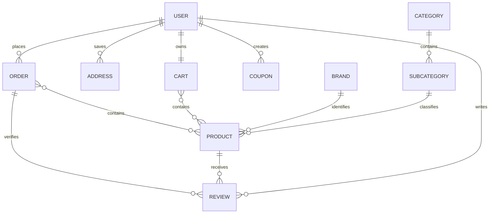

# E-Commerce REST API

A modular REST API for an e-commerce platform, built with Node.js, Express, and MongoDB. The project covers account authentication, product variants, categories, brands, carts, coupons, orders, reviews, image uploads, and customer delivery addresses.

> This project is under active development and is not yet production-ready. See [Current limitations](#current-limitations) before deploying it.

## Features

- User registration, email confirmation, login, and password recovery
- JWT-based authentication
- Category, subcategory, and brand management
- Products with multiple variants, options, stock, discounts, and images
- Cloudinary image storage
- Shopping cart management
- Percentage and fixed-value coupons
- Order creation from a cart or a supplied product list
- Verified-purchase product reviews and aggregate ratings
- User-owned delivery addresses with default-address handling
- Request validation with Joi
- Automated tests using Node.js's built-in test runner

## Tech stack

- **Runtime:** Node.js with ES modules
- **Framework:** Express 5
- **Database:** MongoDB with Mongoose
- **Authentication:** JSON Web Tokens and bcryptjs
- **Validation:** Joi
- **File uploads:** Multer and Cloudinary
- **Email:** Nodemailer with Gmail
- **Testing:** `node:test` and `node:assert`

## Project structure

```text
.
|-- config/                 # Local environment variables (not committed)
|-- DB/
|   |-- Models/             # Mongoose models
|   `-- connection.js       # MongoDB connection
|-- Src/
|   |-- Middelware/         # Authentication and shared validation
|   |-- Modules/            # Feature routes, controllers, and validation
|   |   |-- Address/
|   |   |-- Auth/
|   |   |-- Brand/
|   |   |-- Cart/
|   |   |-- Category/
|   |   |-- Coupon/
|   |   |-- Order/
|   |   |-- Product/
|   |   |-- Review/
|   |   |-- SubCategory/
|   |   `-- User/
|   |-- Utills/             # JWT, hashing, email, uploads, and errors
|   `-- index.route.js      # Main route registration
|-- tests/                  # Node.js tests
|-- .env.example
|-- index.js                # Application entry point
`-- package.json
```

## Getting started

### Prerequisites

- Node.js 20.19 or newer (required by the installed Mongoose version)
- MongoDB, either local or hosted
- A Cloudinary account for image uploads
- A Gmail account with an app password for email delivery

### Installation

1. Clone the repository and enter its directory:

   ```bash
   git clone <your-repository-url>
   cd Ecommerce
   ```

2. Install dependencies:

   ```bash
   npm install
   ```

3. Copy `.env.example` to `config/.env` and replace the placeholder values.

   On macOS or Linux:

   ```bash
   cp .env.example config/.env
   ```

   On Windows PowerShell:

   ```powershell
   Copy-Item .env.example config/.env
   ```

4. Start the API:

   ```bash
   node index.js
   ```

The server runs at `http://localhost:3000`.

## Environment variables

| Variable | Purpose |
| --- | --- |
| `DB_LOCAL` | MongoDB connection string |
| `SALT_ROUND` | bcrypt hashing rounds |
| `TOKEN_SIGNATURE` | Secret used to sign and verify JWTs |
| `expireTime` | JWT lifetime passed to `jsonwebtoken`, in seconds |
| `BEARER_KEY` | Authorization prefix, usually `Bearer ` including the space |
| `MOOD` | Application environment label |
| `App` | Cloudinary folder name used by category and subcategory uploads |
| `APP` | Cloudinary folder name used by product uploads |
| `gmail` | Gmail sender address |
| `gmailPass` | Gmail app password |
| `cloud_name` | Cloudinary cloud name |
| `api_key` | Cloudinary API key |
| `api_secret` | Cloudinary API secret |

Never commit `config/.env`. It is already excluded by `.gitignore`.

## Authentication

Protected endpoints expect the JWT returned by `POST /auth/login`:

```http
Authorization: Bearer <token>
```

The exact prefix is configured through `BEARER_KEY`.

### Example registration

```bash
curl -X POST http://localhost:3000/auth/signup \
  -H "Content-Type: application/json" \
  -d '{
    "name": "Jane Doe",
    "email": "jane@example.com",
    "phone": "01000000000",
    "password": "strong-password",
    "cPassword": "strong-password"
  }'
```

After registration, the user must follow the confirmation link sent by email before logging in.

### Example login

```bash
curl -X POST http://localhost:3000/auth/login \
  -H "Content-Type: application/json" \
  -d '{
    "email": "jane@example.com",
    "password": "strong-password"
  }'
```

## API reference

Routes marked **Protected** require the `Authorization` header. File-upload routes use `multipart/form-data`; other request bodies use JSON.

### Authentication

| Method | Endpoint | Access | Description |
| --- | --- | --- | --- |
| `POST` | `/auth/signup` | Public | Register a user and send confirmation links |
| `POST` | `/auth/login` | Public | Log in a confirmed user and return a JWT |
| `GET` | `/auth/emailConfirmation/:token` | Public | Confirm an email address |
| `GET` | `/auth/newconfirmationemail/:token` | Public | Send another confirmation email |
| `PATCH` | `/auth/passcode` | Protected | Send a password-reset OTP |
| `PATCH` | `/auth/resetcode` | Public | Reset a password using an OTP |
| `PATCH` | `/auth/forgetlink` | Public | Send a password-reset link |
| `PATCH` | `/auth/resetlink` | Public | Reset a password using a link; see current limitations |

### Categories and subcategories

| Method | Endpoint | Access | Description |
| --- | --- | --- | --- |
| `GET` | `/category` | Public | List categories with their subcategories |
| `POST` | `/category` | See note below | Create a category with an `image` file |
| `PATCH` | `/category/:categoryId` | See note below | Update a category and optionally replace its image |
| `GET` | `/category/:categoryId/subcategory` | Public | List subcategories in a category |
| `POST` | `/category/:categoryId/subcategory` | Protected | Create a subcategory with an `image` file |
| `PATCH` | `/category/:categoryId/subcategory/:subCategoryId` | Protected | Update a subcategory |

The category write controllers use the authenticated user, but their routes do not currently install the authentication middleware. Add authentication before using these endpoints.

### Brands

| Method | Endpoint | Access | Description |
| --- | --- | --- | --- |
| `POST` | `/brand` | Protected | Create a brand with an `image` file |
| `PATCH` | `/brand/:brandId` | Protected | Update a brand and optionally replace its image |

### Products and variants

| Method | Endpoint | Access | Description |
| --- | --- | --- | --- |
| `POST` | `/product` | Protected | Create a product and its first variant |
| `PUT` | `/product/:productId` | Protected | Update product-level information |
| `POST` | `/product/:productId/variant` | Protected | Add a variant to a product |
| `GET` | `/product/:productId/variant/:variantId` | Public | Get one product variant |
| `PATCH` | `/product/:productId/variant/:variantId` | Protected | Update a variant |
| `DELETE` | `/product/:productId/variant/:variantId` | Protected | Delete a variant |

Product creation uses `multipart/form-data` with the following fields:

- Required text fields: `name`, `description`, `price`, `subCategoryId`, and `brandId`
- Required file field: `mainImage` (one file)
- Optional file field: `subImages` (up to four files)
- Optional fields: `stock`, `discount`, `options`, and `specifications`
- `options` and `specifications` must be JSON-encoded strings when sent as form fields

### Cart

| Method | Endpoint | Access | Description |
| --- | --- | --- | --- |
| `POST` | `/cart` | Protected | Add a product variant to the current user's cart |

Example body:

```json
{
  "productId": "507f1f77bcf86cd799439011",
  "variantId": "507f1f77bcf86cd799439012",
  "quantity": 2
}
```

### Coupons

| Method | Endpoint | Access | Description |
| --- | --- | --- | --- |
| `POST` | `/coupon` | Protected | Create a coupon |
| `PUT` | `/coupon/:couponId` | Protected | Update a coupon |
| `DELETE` | `/coupon/:couponId` | Protected | Delete a coupon owned by the current user |

Example coupon body:

```json
{
  "code": "WELCOME10",
  "discountType": "percentage",
  "discountValue": 10,
  "maxDiscountAmount": 100,
  "minOrderAmount": 500,
  "expireDate": "2027-12-31T23:59:59.000Z",
  "usageLimit": 100,
  "usageLimitPerUser": 1,
  "applicableProducts": [],
  "applicableCategories": [],
  "excludedProducts": []
}
```

For a fixed discount, set `discountType` to `fixed` and omit `maxDiscountAmount`.

### Orders

| Method | Endpoint | Access | Description |
| --- | --- | --- | --- |
| `POST` | `/order` | Protected | Create an order from supplied products or the current cart |

Example body with explicit products:

```json
{
  "phone": ["01000000000"],
  "addressId": "507f1f77bcf86cd799439013",
  "code": "WELCOME10",
  "note": "Please call before delivery",
  "products": [
    {
      "productId": "507f1f77bcf86cd799439011",
      "variantId": "507f1f77bcf86cd799439012",
      "quantity": 2
    }
  ]
}
```

Omit `products` to create the order from the authenticated user's cart.

### Reviews

| Method | Endpoint | Access | Description |
| --- | --- | --- | --- |
| `POST` | `/product/:productId/review` | Protected | Review a product from a delivered order |

```json
{
  "orderId": "507f1f77bcf86cd799439014",
  "rating": 5,
  "comment": "Excellent product"
}
```

Each user can review a product once, and the product's average rating is recalculated after creation.

### Addresses

All address routes are protected and scoped to the authenticated user.

| Method | Endpoint | Description |
| --- | --- | --- |
| `POST` | `/address` | Create an address |
| `GET` | `/address` | List the current user's addresses |
| `GET` | `/address/:addressId` | Get one address |
| `PATCH` | `/address/:addressId` | Update an address |
| `DELETE` | `/address/:addressId` | Delete an address |

Example body:

```json
{
  "label": "home",
  "name": "Jane Doe",
  "phone": "01000000000",
  "country": "Egypt",
  "city": "Cairo",
  "street": "Tahrir Street",
  "buildingNumber": "12",
  "floor": "3",
  "apartmentNumber": "8",
  "deliveryInstructions": "Call on arrival",
  "location": {
    "type": "Point",
    "coordinates": [31.2357, 30.0444]
  },
  "isDefault": true
}
```

The coordinates follow GeoJSON order: `[longitude, latitude]`. The first address is automatically made the default. Setting another address as default unsets the previous default.

## Data model overview



## Testing

Run the test suite with:

```bash
node --test
```

The current tests cover address ownership/default behavior and coupon validation/controller behavior. The `npm test` script is still a placeholder, so use `node --test` until the package script is updated.

## Current limitations

- Role-based authorization is defined but not enforced; authenticated users can currently reach management endpoints.
- Category write routes need authentication middleware.
- A general product-list route is not currently registered.
- The password-reset-link route does not currently expose the token parameter expected by its controller.
- Checkout, coupon calculations, and several update flows are still being refined.
- Payment processing is not implemented; orders default to cash.
- The automated suite currently includes failing coupon-controller tests and should be fixed before CI is enabled.
- Additional request validation, rate limiting, security headers, logging cleanup, and integration tests are recommended before deployment.

## Contributing

1. Fork the repository.
2. Create a feature branch: `git checkout -b feature/my-feature`.
3. Commit your changes.
4. Push the branch and open a pull request.

## License

This project is configured with the ISC license in `package.json`.
